# ANDROID(JAVA)-DOCUMENTATION

[![Youtube][youtube-shield]][youtube-url]
[![Facebook][facebook-shield]][facebook-url]
[![Instagram][instagram-shield]][instagram-url]
[![LinkedIn][linkedin-shield]][linkedin-url]

Thanks for visiting my GitHub account!

 **Android** is a mobile operating system based on a modified version of the Linux kernel and other open-source software, designed primarily for touchscreen mobile devices such as smartphones and tablets.

**Android** is the best-selling open-source Linux-based operating system among various mobile platforms across the globe. Hundreds of millions of mobile devices are powered by Android in more than 190 countries of the world. It conquered around 75% of the global market share by the end of 2020, and this trend is growing bigger every other day. [see-more](https://www.geeksforgeeks.org/android-tutorial/)

### [Code-Example](https://github.com/learnwithfair/android-programs)

## Android Tutorial

[Click-here](https://www.geeksforgeeks.org/android-tutorial/)

## Source Code (Download)

[Click Here](https://mega.nz/folder/RGFiUApD#PoKIVCwF8IkQhE2PHw1XxQ)

### Required Software

- JDK -> [Download](https://www.oracle.com/java/technologies/downloads/#jdk21-windows)
- Android Studio Manager->[Download](https://developer.android.com/studio?gclid=CjwKCAiA_aGuBhACEiwAly57MUzgkiuKNDZDONVUh68zhr_aXqzRxIqK-VLE721HiNpV4DCBdvhPUxoCiQIQAvD_BwE&gclsrc=aw.ds)
- SDK (Auto Download with Studio Manager)
- Netbeans (Optional) ->[Download](https://www.apache.org/dyn/closer.lua/netbeans/netbeans-installers/20/Apache-NetBeans-20r1-bin-windows-x64.exe)

### For Create Custom Background

- Adobe xd-> [Download](https://getintopc.com/softwares/development/adobe-xd-cc-2022-free-download/?id=000464023214)

## Source Code (Download)

- All Files -> [Click Here](https://mega.nz/folder/VOEWURyb#naQmTTMQtXdvjIuZVZmXQQ)
- My Apps -> [Click Here](https://mega.nz/file/MONFxLoQ#p_juwz6HxkkmMzhNHQJszPFbYn8_tv0HXI1UO9UEN4I)
- Slide -> [Click Here](https://mega.nz/file/RP9CQJyD#fEMtA6zuI6Py57f9sdcZloebBxD1HIOv5Qm_hX1sFdo)

## My Apps

[Click Here](https://mega.nz/file/MONFxLoQ#p_juwz6HxkkmMzhNHQJszPFbYn8_tv0HXI1UO9UEN4I)

## For More Information

- Visit -> https://www.tutorialspoint.com/android/index.htm
- Visit -> https://developer.android.com/courses/android-basics-compose/course

## Project Features

|                                                                                                                  |                                                                                       |
| :--------------------------------------------------------------------------------------------------------------: | :-----------------------------------------------------------------------------------: |
|                                                     Overview                                                     |                                        Part-1                                         |
|                  |  |
|                                                      Part-2                                                      |                                        Part-3                                         |
|                             |  |
|                                                      Part-5                                                      |                                        Part-6                                         |
|                             |  |
|                                                       List                                                       |
|  |

## Instalization Process

- JDK -> [Click Here](https://www.youtube.com/watch?v=QKKdrgGQljA&list=PLgH5QX0i9K3p9xzYLFGdfYliIRBLVDRV5&index=4)
- Android Studio Manager -> [Click Here](https://www.youtube.com/watch?v=7nae6RM9we0&list=PLgH5QX0i9K3p9xzYLFGdfYliIRBLVDRV5&index=5)
- Documentation-> [Click Here](https://www.geeksforgeeks.org/guide-to-install-and-set-up-android-studio/)

**Note: Virtualization Must Be Enabled**

## Guide to Install and Set up Android Studio

Step 1: Head over to [this link](https://developer.android.com/studio) to get the Android Studio executable or zip file.

Step 2: Click on the Download Android Studio Button.
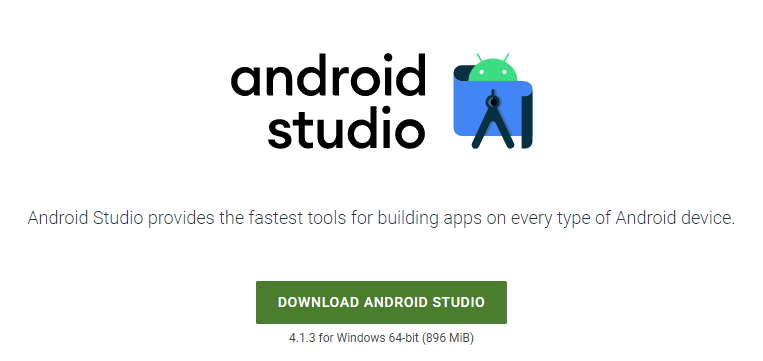

Click on the “I have read and agree with the above terms and conditions” checkbox followed by the download button.

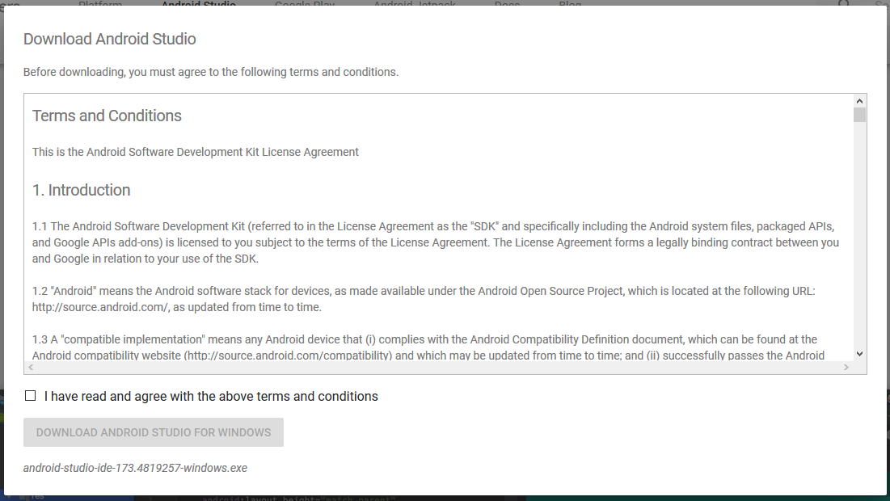

Click on the Save file button in the appeared prompt box and the file will start downloading. 

Step 3: After the downloading has finished, open the file from downloads and run it. It will prompt the following dialog box. 

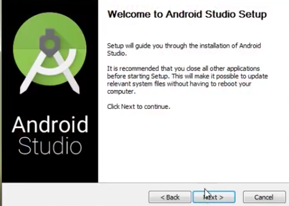

Click on next. In the next prompt, it’ll ask for a path for installation. Choose a path and hit next. 

Step 4: It will start the installation, and once it is completed, it will be like the image shown below. 

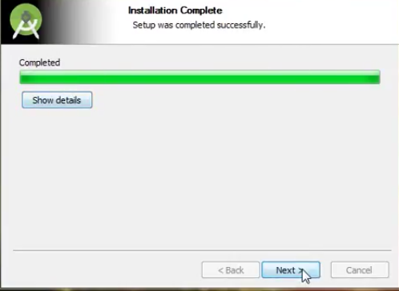

Click on next.

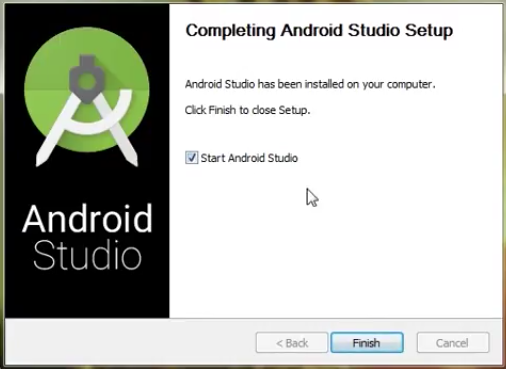

Step 5: Once “Finish” is clicked, it will ask whether the previous settings need to be imported [if the android studio had been installed earlier], or not. It is better to choose the ‘Don’t import Settings option’.  

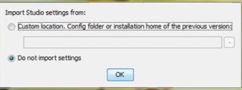

Click the OK button. 

Step 6: This will start the Android Studio. 

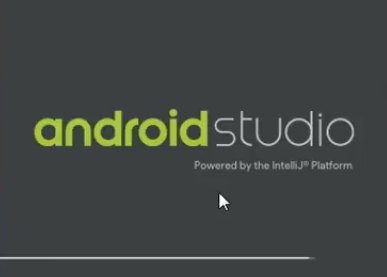

Meanwhile, it will be finding the available SDK components.

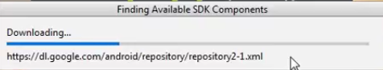

Step 7: After it has found the SDK components, it will redirect to the Welcome dialog box. 

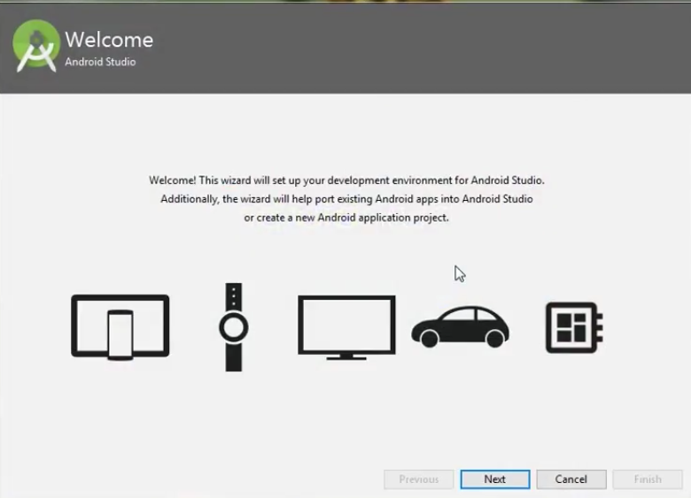

Click on Next. 

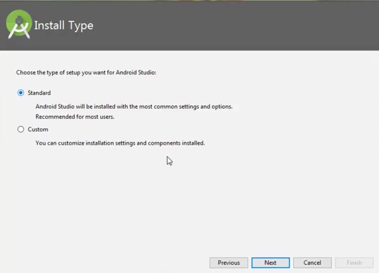

Choose Standard and click on Next. Now choose the theme, whether the Light theme or the Dark one. The light one is called the IntelliJ theme whereas the dark theme is called Dracula. Choose as required. 

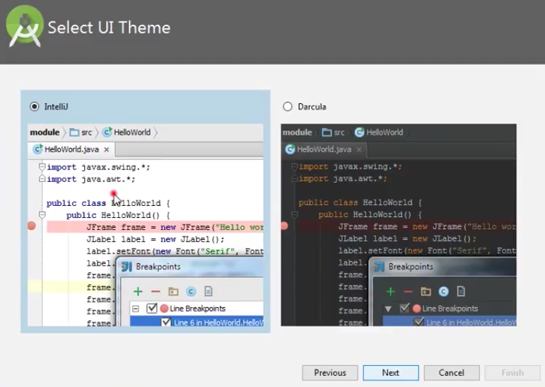

Click on the Next button. 

Step 8: Now it is time to download the SDK components. 

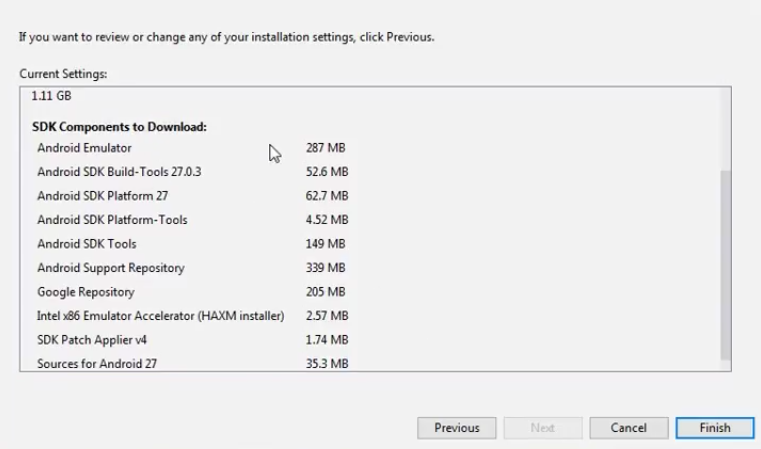

Click on Finish. Components begin to download let it complete.

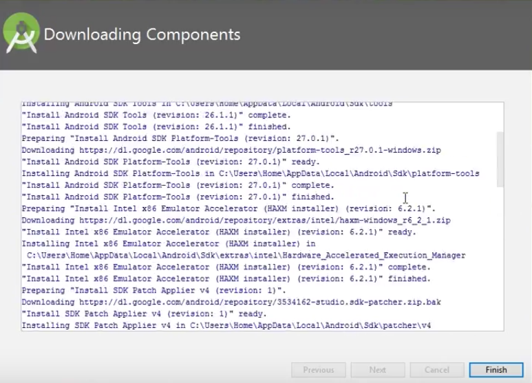

The Android Studio has been successfully configured. Now it’s time to launch and build apps. Click on the Finish button to launch it. 

Step 9: Click on Start a new Android Studio project to build a new app. 

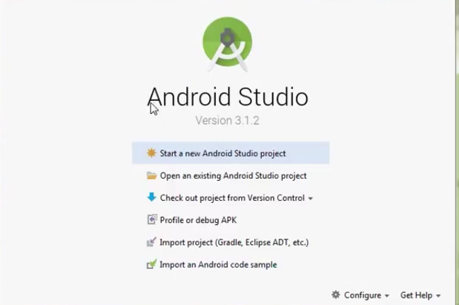

To run your first android app in Android Studio you may refer to [Running your first Android app.](https://www.geeksforgeeks.org/android-running-your-first-android-app/)

## Android - Architecture

Android architecture contains different number of components to support any android device needs. Android software contains an open-source Linux Kernel having collection of number of C/C++ libraries which are exposed through an application framework services.

Among all the components Linux Kernel provides main functionality of operating system functions to smartphones and Dalvik Virtual Machine (DVM) provide platform for running an android application.

**The main components of android architecture are following:-**

- Applications
- Application Framework
- Android Runtime
- Platform Libraries
- Linux Kernel

  **Pictorial representation of android architecture with several main components and their sub components** –

|                                                                                                     |
| :-------------------------------------------------------------------------------------------------: |
|                                            Architecture                                             |
|  |

## Follow Me

    

<!-- MARKDOWN LINKS & IMAGES -->

[youtube-shield]: https://img.shields.io/badge/-Youtube-black.svg?style=flat-square&logo=youtube&color=555&logoColor=white
[youtube-url]: https://youtube.com/@learnwithfair
[facebook-shield]: https://img.shields.io/badge/-Facebook-black.svg?style=flat-square&logo=facebook&color=555&logoColor=white
[facebook-url]: https://facebook.com/learnwithfair
[instagram-shield]: https://img.shields.io/badge/-Instagram-black.svg?style=flat-square&logo=instagram&color=555&logoColor=white
[instagram-url]: https://instagram.com/learnwithfair
[linkedin-shield]: https://img.shields.io/badge/-LinkedIn-black.svg?style=flat-square&logo=linkedin&colorB=555
[linkedin-url]: https://linkedin.com/company/learnwithfair
